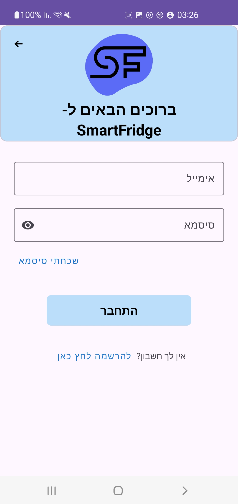
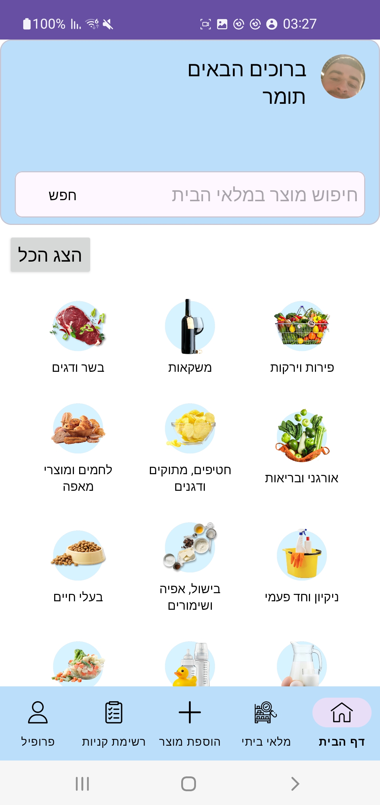
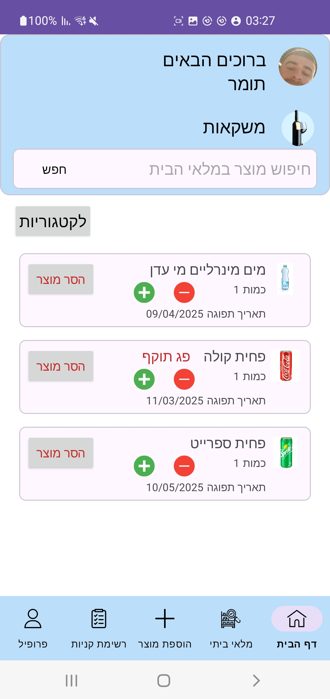
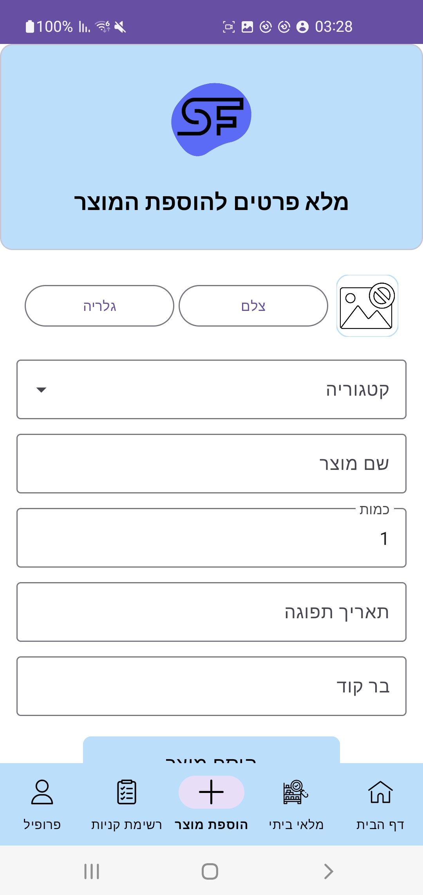
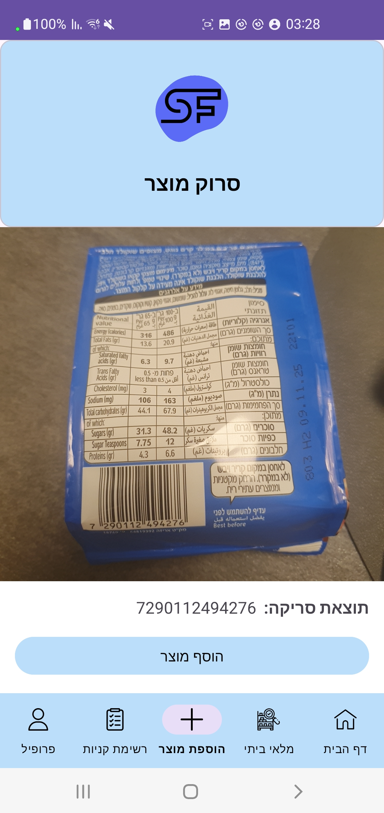
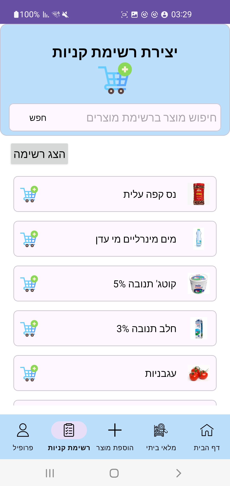
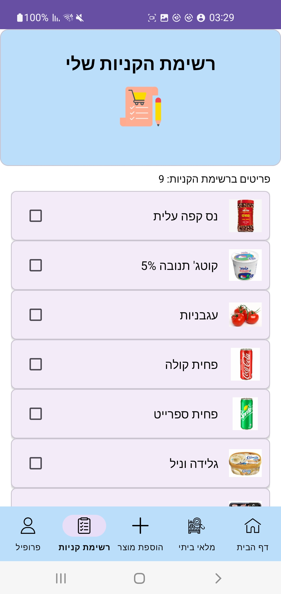
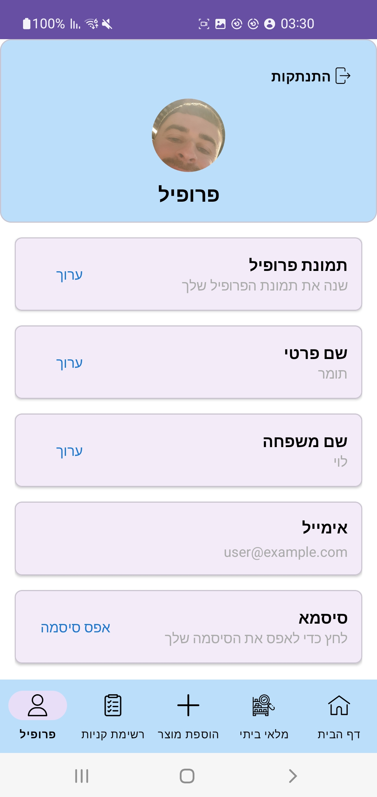

# SmartFridge App

<p align="left">
  
</p>

## 📌 Introduction
SmartFridge is a home inventory management app that helps you keep track of all food and products in your home. Never wonder what's in your fridge or pantry again! This application makes it easy to manage your home inventory, create shopping lists, and track expiration dates.

This app is built with Kotlin and uses Firebase services (Authentication, Firestore, and Storage) for secure user management and data storage.

---

## 🚀 Features

### 🔑 User Authentication
• **Sign Up / Login** with Firebase Authentication  
• **Password Reset** for account recovery  
• **Profile Management** including profile picture updates  
• **Secure Authentication** with email and password

### 🏠 Home Inventory Management
- **View all products** in your home inventory
- **Filter products by category** for easy navigation
- **Search for specific products** with the search function
- **Update product quantities** with simple +/- controls
- **Remove products** from inventory when consumed
- **Track expiration dates** with visual indicators for expired products

### 🛒 Shopping List
• **Create shopping lists** for your next trip to the store  
• **Add products** to your shopping list  
• **View your current shopping list** in a user-friendly format  
• **Check off items** as you buy them  
• **Manage multiple shopping lists** for different stores or purposes

### 📷 Barcode Scanning
- **Add products by scanning** their barcode
- **Automatic lookup** in product repository
- **Manual entry option** for new products
- **Quick and efficient** product addition process

### 📋 Categories
• **Products organized into categories** (Fruits & Vegetables, Drinks, Meat, etc.)  
• **Easy navigation** between categories  
• **Visual indicators** for each category  
• **Quick filtering** to find what you need

---

## 📱 Screens

### 👋 Welcome Screen
<p align="left">
  
</p>

### 🔑 Login & Register Screens
<p align="left">
   
</p>

### 🏠 Home Screen
<p align="left">
  
</p>

### 📦 Products List Screen
<p align="left">
  
</p>

### ➕ Add Product Screens

<p align="left">
   
</p>

### 🛒 Shopping List Screens
<p align="left">
   
</p>

### 👤 Profile Screen
<p align="left">
  
</p>

---

## 📂 Project Structure
```
SmartFridge_App/
│
├── app/
│   ├── src/
│   │   └── main/
│   │       ├── java/com.example.smartfridge_app_finalproject/
│   │       │   ├── adapters/             # RecyclerView adapters for lists
│   │       │   ├── data/                 # Data layer components
│   │       │   │   ├── model/            # Data classes (Product, User, etc.)
│   │       │   │   └── repository/       # Firebase repository implementations
│   │       │   ├── fragments/            # UI fragments for main screens
│   │       │   ├── managers/             # Business logic managers
│   │       │   ├── interfaces/           # Interface definitions
│   │       │   └── utilities/            # Helper classes and constants
│   │       │
│   │       ├── res/                      # Android resources
│   │       └── AndroidManifest.xml
│   │
│   ├── build.gradle.kts
│   └── google-services.json
│
├── build.gradle.kts
└── README.md
```

---

## 🏗️ Architecture

The app follows a clean architecture with:
- **Models:** Data classes representing entities like `Product`, `User`, `Category`
- **Repository Pattern:** Data access layer handling Firebase communication
- **Manager Classes:** Business logic implementation for various features
- **UI Components:** Activities and Fragments handling user interaction
- **Firebase Integration:** Authentication, Firestore, and Storage

---

## 🛠️ Tech Stack

- **Programming Language:** Kotlin
- **Database:** Firebase Firestore
- **Authentication:** Firebase Auth
- **Storage:** Firebase Storage
- **UI Components:** Material Design 3

---

## 🚀 Getting Started

### Prerequisites
- Android Studio
- Firebase account
- Google Play Services

### Setup
1. Clone the repository
2. Open the project in Android Studio
3. Connect your Firebase project:
   - Create a Firebase project in the Firebase Console
   - Add an Android app to the project
   - Download the `google-services.json` file
   - Place the file in the app directory
4. Enable the following Firebase services:
   - Authentication (Email/Password)
   - Firestore Database
   - Storage
5. Run the app on your device or emulator


